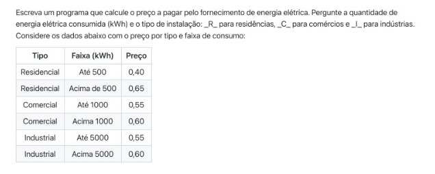

# Atividade: Explorando Estruturas de Decisão

* Este repositório contém uma atividade projetada para explorar e praticar o uso de estruturas de decisão em programação em Python. 

## Objetivos
* Compreender o funcionamento das estruturas de decisão.
* Praticar a utilização de condicionais em diversas situações.
* Desenvolver habilidades de resolução de problemas de forma lógica e sistemática.

## Dados usados no código

## Contribuição
* Contribuições são bem-vindas! Se você tiver sugestões para novos problemas ou melhorias nas soluções existentes, sinta-se à vontade para abrir uma issue ou enviar um pull request.